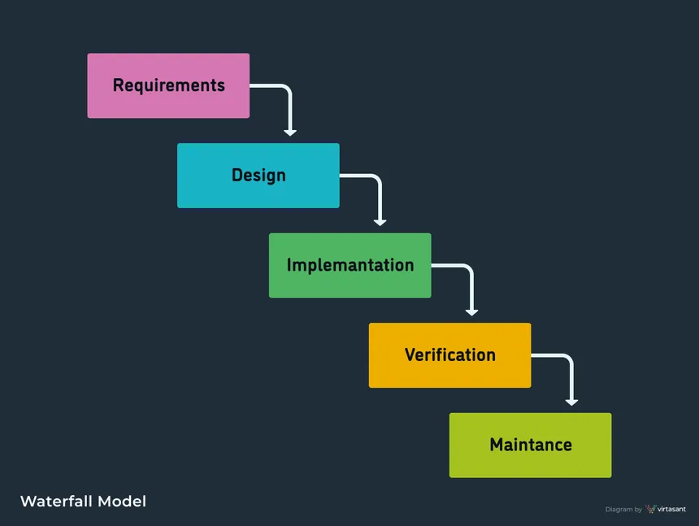

# Some details about the project .

## Description of the project . 
`Help the college to take the attendance of students online and to document the process in EXEL sheet.
provide the ability to students to rate the demonstrators and doctors `

## Analysis cycle **SDLC**
- Waterfall process .

  `Because we needed to document every single process involved into the production for any maintainance in the future by another team .`

### Who contributes into the project .
    - Mahmoud Gamal 
        - Design  phase
        - implemetation phase 

    - Mohamed Hamed 
        - planning phase 
        - analysis phase 

