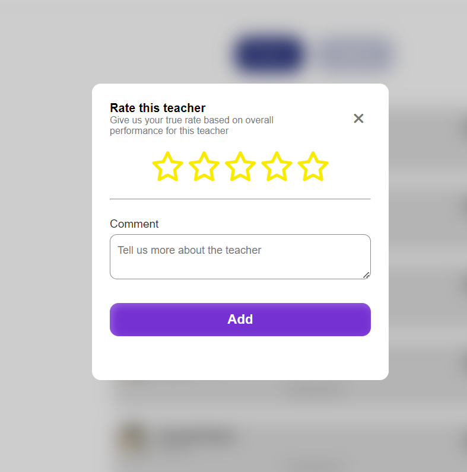

### Rating mechanism analysis 

#### Purpose : 
- The goal is to give the students the ability to express their opinions 
- To add a competitvness feeling between the instructors due to the ranks 

#### Requirments :
1. The system gives the ability to rate the instructor after you attend the session 
2. It gives the ability to add comments 
#### Constraints : 
- Rating may not be fair if students can not judge accurately 
- Students may use a bad language when they comment to their instructors 